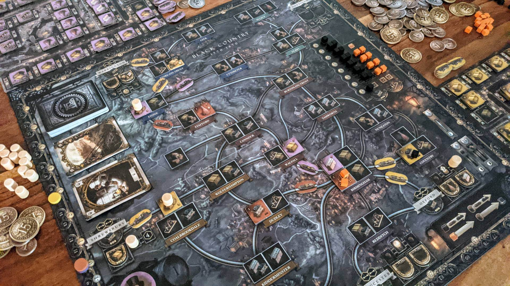
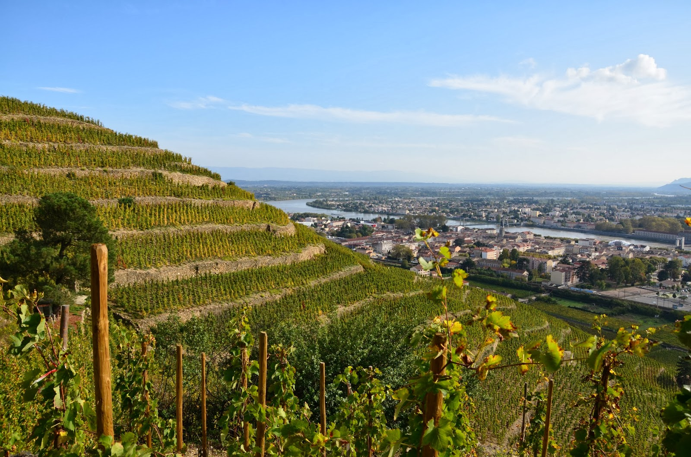
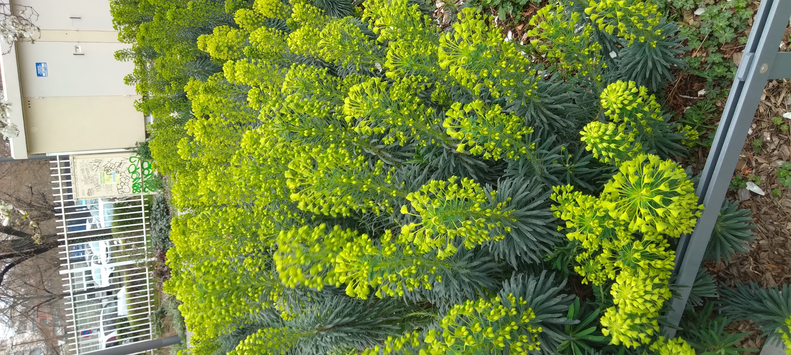

This blog is multi purpose and will serve as a diary, a self-reminder of what happened in the Phd and a repository for useful software code that I can easily share with others.

I am currently in the second year of a PhD in Applied Mathematics. My research focuses on active learning and uncertainty quantification, mainly using conformal prediction approaches applied to computer vision.

I am doing my PhD at Michelin, where there is a high demand for machine vision and not enough experts to label the data.

I love learning and am very curious but software development is far from being a strength.

My passions :) 

:::{layout="[[1, 1], [1]]"}

:::